# Storefront Builder

Artists sell commissions from pages they host on Markdown paste sites like
rentry.co. They do not know Markdown, so they learn table syntax or pay someone
who has. This turns that into a compiler problem.

A block document goes in. Host-correct Markdown comes out, along with a warning
for every compromise made on the way.

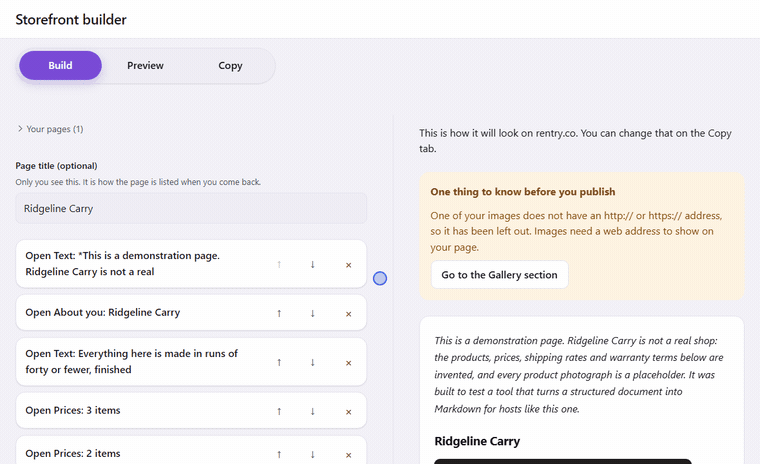

*Twelve seconds, recorded from the built app: start from a template, change a
price, watch the preview catch up, and copy the Markdown out for the host you
chose. Nothing here is a mockup. `npm run shots` regenerates every image on
this page.*

**Try it:** [jakobs1900.github.io/markdown-storefront-builder](https://jakobs1900.github.io/markdown-storefront-builder/)
Works on a phone, installs to a home screen, and runs with no network. Nothing
is sent anywhere: storage, compilation, and preview are all local.

**On a phone:** the same code wrapped natively for Android. Download the signed
APK from [Releases](https://github.com/JakobS1900/markdown-storefront-builder/releases),
or read `docs/RELEASE.md` to build your own.

**A page it produced:** [rentry.co/q7nyo28n](https://rentry.co/q7nyo28n), a
complete storefront with price tables, a gallery, shipping bands and terms.
Twelve sections in, 6,673 characters of Markdown out, pasted into the real host.

**Case study:** [jakobs1900.github.io/portfolio/storefront-builder.html](https://jakobs1900.github.io/portfolio/storefront-builder.html)

## What it looks like

Six phone screens, in order, from arriving to pasting.

| 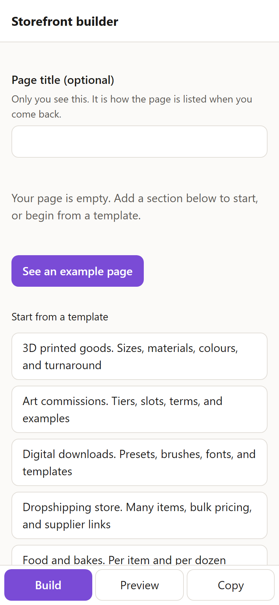 | 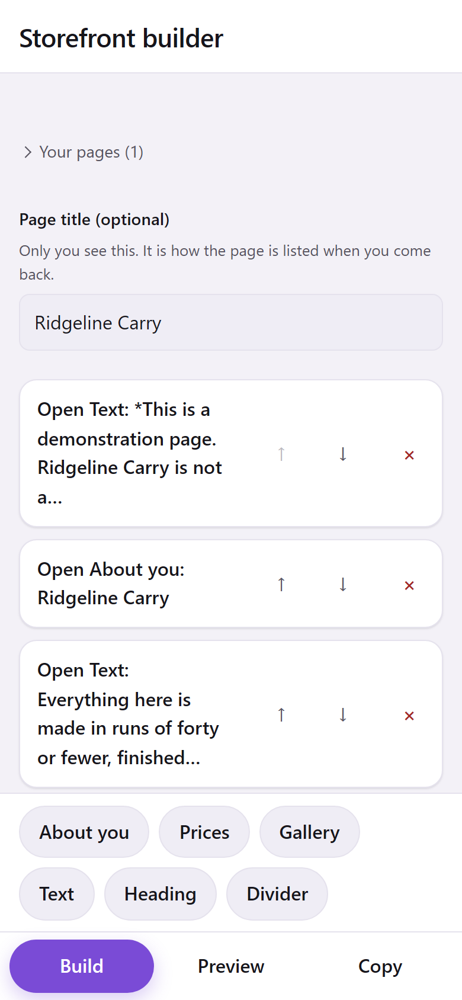 | 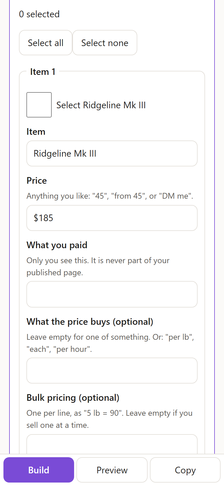 |
|:--|:--|:--|
| **Arrive.** An example page and eight templates. The first screen is something to change, not an empty form. | **A page is a list of sections.** Move one, remove one, open one. There is no Markdown on this screen and never is. | **Open a section and fill it in.** Fields with ordinary names. The syntax is the compiler's problem, not yours. |

| 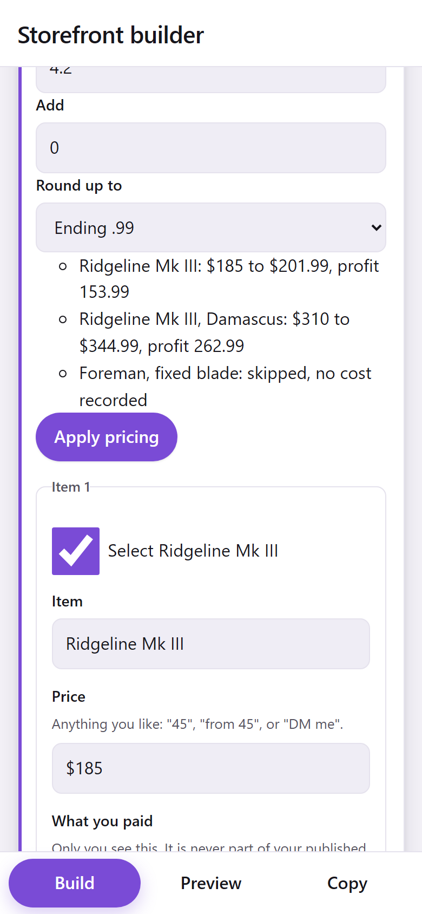 | 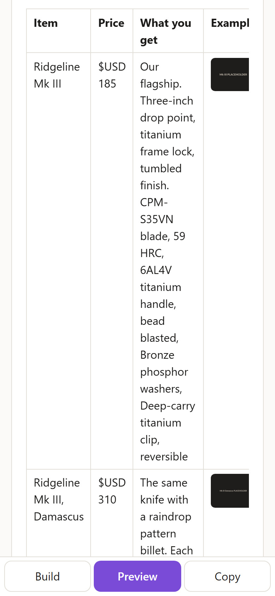 | 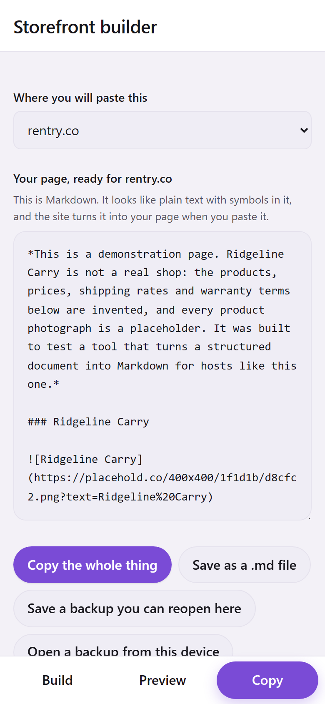 |
|:--|:--|:--|
| **Price the whole list at once.** Cost times a multiplier, rounded, previewed row by row before a single price is written, and reversible in one press. A row with no cost recorded is named and skipped rather than guessed at. | **See it before you post it.** The preview renders the compiled Markdown and says plainly that it approximates the host rather than being it. | **Copy it out.** Pick where you are pasting and the output changes with it, along with the steps underneath for that host. |

### The part you would otherwise pay somebody to know

<table>
<tr>
<td width="42%">

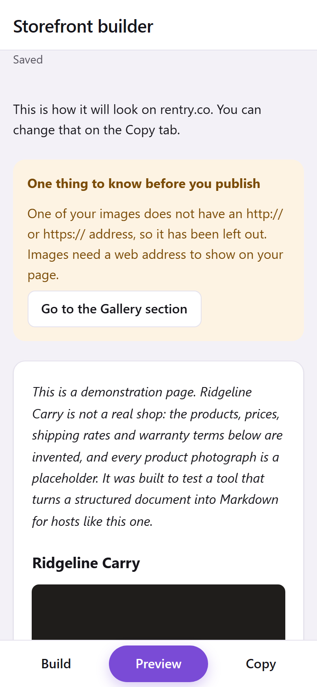

</td>
<td>

Every compromise the compiler makes is reported, in the artist's words, with a
button that goes to the section it happened in. That is the whole product: not
that it writes Markdown, but that it tells you what the host will not do with
it before you find out in public.

This one was provoked on purpose for the screenshot, by naming a picture the
way a person names a file on their own computer.

</td>
</tr>
</table>

### On a screen with room for it

The preview moves beside the editor rather than onto a tab of its own. Both
palettes ship, so both are tested and both are shown.

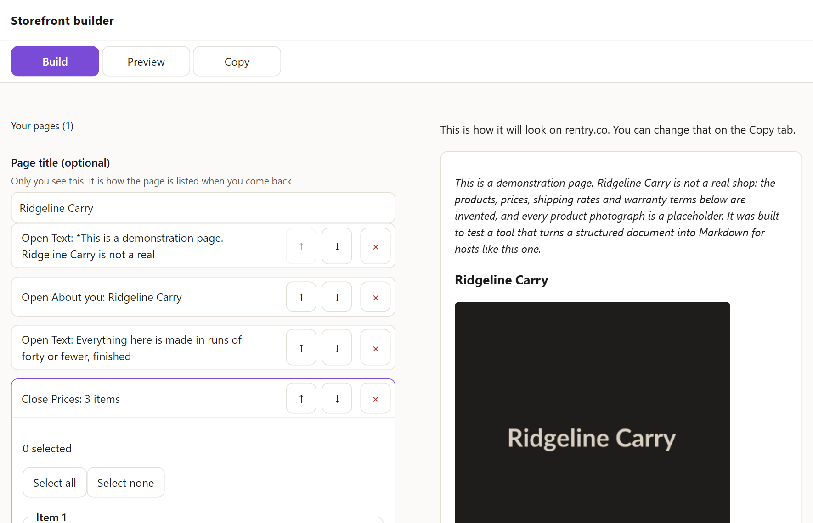

<table>
<tr>
<td width="30%">

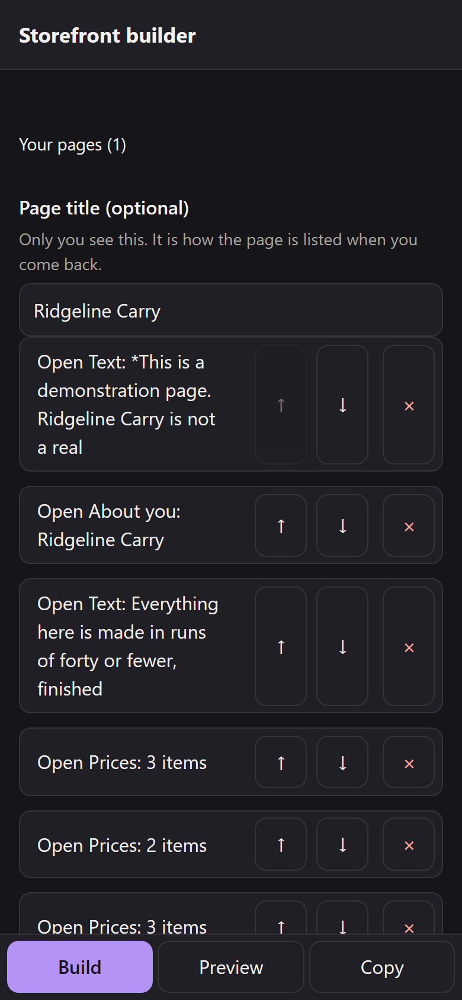

</td>
<td>

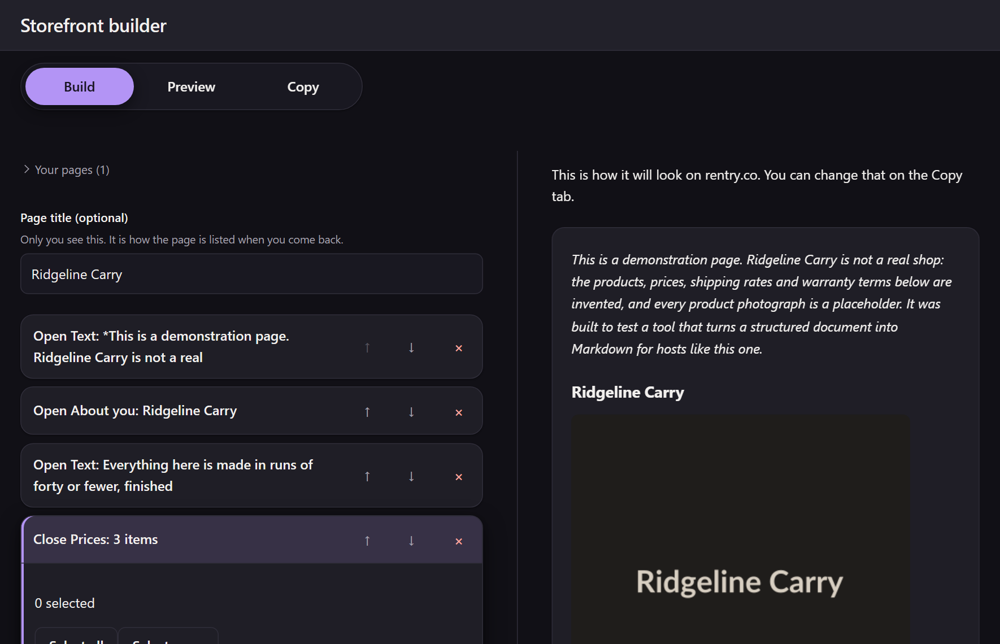

</td>
</tr>
</table>

Contrast in both is measured rather than eyeballed. `npm run contrast` runs
axe in headless Chrome over a real storefront, once in each palette, and
refuses to report a pass unless enough content was actually on screen.

## Running it

```powershell
npm install     # from PowerShell, not Git Bash. See CLAUDE.md for why
npm run dev     # the app
npm run verify  # typecheck, lint, 991 tests, secret scan, dash scan, accessibility
npm run shots   # regenerates every image above from the built app
```

## What is where

| Path | What it is |
|---|---|
| `engine/src/document/` | The contract. A versioned page format, its validator, and a canonical writer. Pure, zero dependencies. |
| `engine/src/compile/` | The compiler. Hosts described as data, one emitter per section type, and a lint pass that reports every compromise. |
| `engine/tests/compile/golden/` | Expected output, byte compared. Readable Markdown, so a human can judge a diff. |
| `app/` | The editor. Mobile first, local only, no account, no framework. |
| `android/` | The native shell. A Capacitor wrapper, a back handler, and a file handoff, because a `download` attribute does nothing in a WebView. |
| `docs/media/` | The images on this page, and `demo.mp4` for anywhere a GIF is too coarse. Written by `scripts/screenshots.mjs`, which drives the built app in headless Chrome and fails the run if a step it was told to perform found nothing to press. |
| `specs/` | Every specification, committed beside the code. `specs/README.md` says which ones were written before the code and which after, because most were after. |
| `docs/research/` | What was observed on a live host, with the date. Every capability value in a target record cites one of these. |

## The parts worth reading

**`engine/src/document/descriptor.ts`** is the schema, and it is data. The
validator walks it, the writer emits keys in its order, and a parity test
snapshots it, so a change to any field name, type, or order fails the build.
The TypeScript types are derived from it rather than maintained alongside it,
because two hand-written artifacts that must agree eventually will not.

**`engine/src/compile/targets.ts`** is every supported host, described entirely
as capability values with a cited source for each. No emitter branches on which
host it is compiling for. A test proves that by inventing a host inside the test
and compiling against it, which only works if the claim is true.

**`engine/src/compile/escape.ts`** is the one that would keep me up. Artist text
lands on a page hosted on someone else's domain, whose renderer I cannot
inspect, so `<`, `>`, and `&` become HTML entities rather than backslash
escapes. The character is absent from the output entirely, and no renderer can
build a tag out of what is not there.

**`engine/tests/compile/golden/portable/hostile-page.md`** is the security
argument as something you can read in thirty seconds: a script tag entity
encoded, a `javascript:` link rendered inert as plain text, a `data:` image
dropped, pipes escaped with the table still rectangular.

**`specs/*/holistic-review.md`** are the reviews, including the findings that
make me look slow. The most valuable defect in the project was found by opening
the app and clicking the first button, and it is written up as such.

## What is enforced rather than intended

- **Engine purity** is an ESLint rule. `engine/src/**` cannot reference
  `document`, `window`, `fetch`, `Date.now`, or `Math.random`.
- **Schema drift** fails a parity test on every field name, type, and order.
- **Output correctness** is byte compared against checked-in Markdown.
- **Accessibility** runs axe-core over the rendered interface, plus assertions a
  machine cannot make: every control has a real name, no placeholder stands in
  for a label, the touch target minimum is in the stylesheet.
- **Colour contrast** runs axe in headless Chrome, which has real layout, over
  the example storefront in both the light and dark palettes. It refuses to
  report a pass unless real content was on screen when it measured.
- **Updating** deploys a second build over a cached first one in a real browser
  and checks a returning visitor ends up on the new one. A stale shell is a
  blank page with no error, which is the worst kind of bug to ship to strangers.
- **No secrets** and **no em or en dashes** each have their own scanner.

Each gate was verified by making it fail on purpose, not by assuming it works.

## Known limitations, stated rather than buried

**The three hosts barely differ, and currently agree entirely.** rentry,
text.is, and the portable baseline produce byte identical output for every
fixture. That was not always true. Until 2026-09-01 portable used the
CommonMark backslash hard break and the other two used two trailing spaces,
because live verification had found the backslash silently broken on rentry.
Verifying text.is found it worse there, consuming the newline and the space so
two sentences publish as one word, which meant the backslash was a working hard
break on none of the real hosts and only on the specification. Portable moved
to the form that works, and the divergence closed.

So the compatibility machinery is still mostly proved by synthetic hosts in the
tests rather than by disagreement between the shipped ones. What the real hosts
have proved is narrower and more useful: that a value nobody checked is usually
wrong. Every capability on every host cites the observation it came from, and
`docs/research/` holds the transcripts.

**The published build has no image uploading, on purpose.** There is no upload
button. The image field takes a web address, and tells an artist to upload at
imgur.com, which needs no account, and paste the address it gives back. That is
the flow people already use, and it is verified on a phone.

The alternative was one Imgur Client-ID baked into the bundle and shared by
every artist. It is a better experience, and it was rejected for a specific
reason rather than a vague one. A Client-ID identifies the application, not a
user, so anonymous uploads made with it belong to no account and never appear
in the owner's gallery. But the registration is the owner's, and so is the
responsibility: one artist uploading something against Imgur's rules gets the
**application** banned, and uploads then break for every user at once, with no
warning. The daily quota is shared the same way.

The obvious fix, asking each artist to register their own, is worse than the
problem. Registering an API application is harder than learning the Markdown
this whole project exists to remove, so that path fails Principle VI before it
starts.

The upload code is still there and still tested, for anyone building their own
copy. Set `VITE_IMGUR_CLIENT_ID` and the button appears. See `.env.example`.
Be aware of what you are taking on: the key is a public identifier that ships
in the bundle, anyone can copy it out and spend your quota, and the answer to
that is to register a new one and rebuild.

One trap worth knowing if you do. An invalid or revoked Client-ID makes
`POST /3/image` answer 429 "Too Many Requests", which is indistinguishable from
a real rate limit, while `GET /3/credits` answers 403 "Invalid client_id". A
dead key looks exactly like a busy afternoon.

## Licence

[MIT](LICENSE). Do what you like with it, including commercially. Keep the
copyright notice and it is yours to use.

It briefly carried a noncommercial licence, while the plan was a paid Android
build. That plan is gone, so the restriction went with it. There is no store
listing and there is not going to be one: the app is free here, the web version
is free, and neither is going to grow a price.
