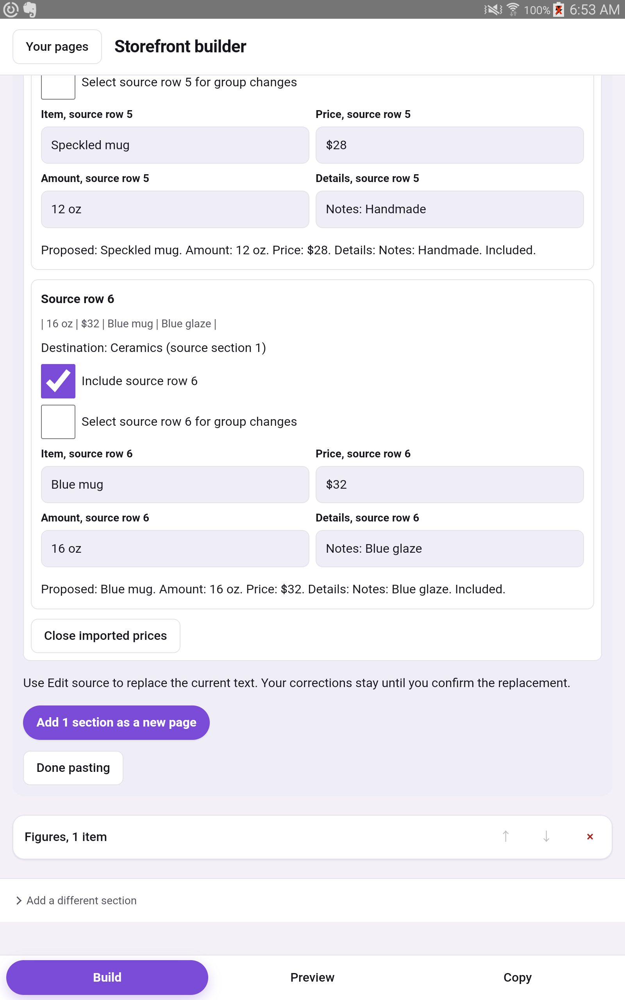

# Compact import correction verification

## Baseline

Feature 034 implements the approved first recommendation in the
[usability audit](2026-10-05-usability-follow-up.md). Baseline application code
is `1338afd`; tablet build is signed test.7, versionCode 25.

Before product changes, the SM_T700 opened fictional qa-corrections.md through
DocumentsUI and Adjust imported prices. For source row 6, UIAutomator recorded:

| Control | Physical screen bounds |
| --- | --- |
| Item input | [104,496][1496,592] |
| Amount input | [104,660][1496,756] |
| Price input | [104,824][1496,920] |
| Details input | [104,988][1496,1084] |

The label-to-last-input span is 642 physical pixels, from Item label y442 to
Details bottom y1084. All inputs occupy the same full-width column. The awake
screenshot is retained in ignored temp/034-before.png, with raw XML in
temp/034-tablet-before.xml. No saved page was changed by this baseline draft.

## Browser evidence

The new actual-shell browser check failed before the product edits: the 800px
view stacked all fields and DOM order was Item, Amount, Price, Details. It passed
after the wrapper and CSS grid change. DOM and tab order are now Item, Price,
Amount, Details. The missing-price action remains outside the field grid.

| Viewport | Long card before | Long card after | Blank-price card before | Blank-price card after |
| --- | ---: | ---: | ---: | ---: |
| 800px | 632.8125 | 468.6875 | 663.515625 | 499.390625 |
| 390px | 780.96875 | 780.96875 | 768.296875 | 768.296875 |
| 320px | 852.25 | 852.25 | 793.09375 | 793.09375 |

Heights are CSS pixels. Both tablet cards shrink by 164.125px. The long card is
25.9% shorter. Phone heights are unchanged. All widths have zero horizontal page
overflow. Inputs remain 47.578125px high. Real Tab and text insertion preserve
field focus and store values at all three widths. Source, destination, warnings,
outcome, blank-price choice and excluded-row controls remain available.

The three existing page-paste test suites passed: 181 tests. Independent spec
review passed. Quality review accepted the product change and identified a test
harness isolation issue: its fixed debugging port could connect to another
Chrome. The test now discovers the assigned debugging port from DevToolsActivePort
inside its own temporary profile. The quality reviewer reread the fix and closed
the finding. Final focused lint and browser runs passed.

Full `npm run verify` exited 0: 94 files and 1,968 tests, then 65 accessibility
tests, typecheck, lint, secret and dash scans, light/dark contrast, native file
input browser checks, local-picture checks, the new import-layout gate and the
service-worker update check. Log: ignored temp/034-verify.log.

## Native and delivery evidence

Signed `0.13.0-test.8`, versionCode 26, built successfully in 43 seconds and
installed with `adb install -r` on SM_T700 `3404d221b89fc1f1`, Android 6.0.1,
WebView 106. APK v1/v2/v3 signatures verify with the existing release certificate
`c952b39cfd7b335efe5269fb25b8a17e4c6aaeb757aa1d1e5453e45b123018e0`.
The packaged entry JS, legacy JS and CSS match the current app build byte for
byte. APK SHA-256:
`d1147e2c38b7176b7b2f21a7d7023ce88b98f74e1a99655dece05b0f8a8c0676`.

After updating, all nine saved pages retained their titles and edit times.
The same fixture was opened through DocumentsUI. For source row 6:

| Control | Physical screen bounds |
| --- | --- |
| Item input | [104,1192][792,1290] |
| Price input | [808,1192][1496,1290] |
| Amount input | [104,1356][792,1454] |
| Details input | [808,1356][1496,1454] |

The Item label starts at y1140, giving a 314px field area versus 642px before.
The two-column change saves 328 physical pixels. Source, destination, both
selection controls and proposed output remain outside the grid. Screenshot:
.

The installed default IME was the automation keyboard. Temporarily switched to
Samsung Keyboard to check the actual full-height keyboard. Price editing retained
focus, native key taps changed the value, and Next moved to Amount. Edited the
second item to Azure mug and its price to $36, attempted a column change and
cancelled it. Both edits remained. Saved as a separate Ceramics page; Preview
showed Azure mug, $36, 16 oz and Notes: Blue glaze. Copy contained the same values
with the expected Markdown escaping. Force-stop and relaunch preserved them.
The page drawer then listed all nine originals plus this new test page.

Restored the original `com.github.uiautomator/.AdbKeyboard` IME and confirmed
`stay_on_while_plugged_in=0`. No restart is required. Raw UI evidence and build
logs are under ignored temp/034-*. The device check is scripted verification,
not independent seller usability research. No native phone was available; narrow
phone layouts were checked in real desktop Chrome at 320px and 390px.

Nonblocking build warnings remain: existing Gradle deprecations and flatDir
configuration, plus the apksigner warning for unsigned META-INF build metadata.
Signature verification itself passed.

Delivery: implementation `c4a48ee`, [PR #4](https://github.com/JakobS1900/markdown-storefront-builder/pull/4),
[passing CI](https://github.com/JakobS1900/markdown-storefront-builder/actions/runs/37321161631),
and [signed test.8 prerelease](https://github.com/JakobS1900/markdown-storefront-builder/releases/tag/v0.13.0-test.8).
The feature is distributed as a prerelease; integration of the stacked PRs into
master is still pending.
